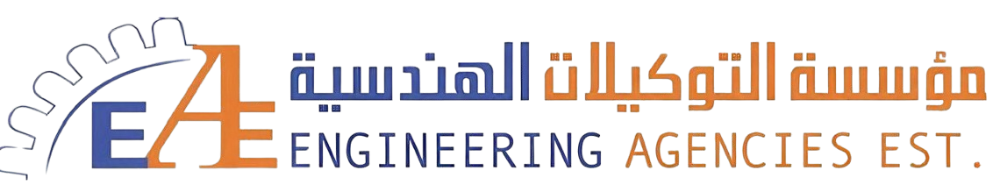

<!-- <p align="center">
  
</p> -->

<h1 align="center">EAE — Agencies Establishment</h1>

<p align="center">
  <strong>Premium Automotive Workshop Equipment — Saudi Arabia</strong>
</p>

<p align="center">
  
  
  
  
  
</p>

<p align="center">
  <a href="https://eae-ksa.com">Live Site</a> •
  <a href="#-features">Features</a> •
  <a href="#-getting-started">Getting Started</a> •
  <a href="#-project-structure">Structure</a>
</p>

---

## 📖 About The Project

EAE is the official website for **Agencies Establishment (EAE)**, a Saudi-based company founded in **2013** and headquartered in Riyadh. We specialize in supplying, installing, and servicing professional automotive workshop equipment — including spray booths, car lifts, screw air compressors, and specialty tools — to workshops and service centers across the Kingdom.

This project is a fully bilingual (Arabic / English) web application built from the ground up with **React 18**, **TypeScript**, and **Vite**. It features RTL/LTR layout switching, dark/light theming, a dynamic product catalog with variant grouping, a project gallery with lightbox, and integrated WhatsApp CTAs for instant client inquiry.

---

## 🛠 Built With

| Technology | Purpose |
|---|---|
| **React 18** | Component-based UI framework |
| **TypeScript** | Type-safe development |
| **Vite** | Lightning-fast dev server & build tool |
| **Tailwind CSS** | Utility-first styling |
| **Shadcn UI** | Accessible, composable UI primitives |
| **React Router v6** | Client-side routing & nested layouts |
| **Lucide React** | Modern icon library |
| **Context API** | Language (AR/EN) & Theme (Dark/Light) state |

---

## ✨ Features

- 🌐 **Bilingual Support** — Full Arabic & English with RTL/LTR layout switching
- 🌗 **Dark / Light Mode** — Theme toggle with persistent preference
- 🛒 **Product Catalog** — Filterable by category with detailed spec pages
- 🔀 **Product Groups** — Variant selection pages (e.g., choose between lift models)
- 🖼 **Projects Gallery** — Real project images with full-screen lightbox, keyboard navigation, and counters
- 📊 **Animated Stats** — CountUp animations triggered on scroll via IntersectionObserver
- 💬 **WhatsApp Integration** — Pre-filled inquiry messages per product
- 📱 **Fully Responsive** — Optimized for mobile, tablet, and desktop
- ⚡ **Vite Glob Imports** — Auto-imports project images from asset directories

---

## 📁 Project Structure

```
src/
├── assets/
│   ├── projects/
│   │   ├── car-lift-large/       # 24 images
│   │   ├── car-lift-small/       # 2 images
│   │   ├── compressor/           # 2 images
│   │   ├── scissor-lift/         # 4 images
│   │   └── spray-booth/          # 7 images
│   └── *.jpg / *.png             # Product & brand assets
├── components/
│   └── eae/
│       ├── Navbar.tsx
│       ├── Footer.tsx
│       ├── HeroSlider.tsx
│       ├── BackButton.tsx
│       ├── FloatingWidgets.tsx
│       ├── FeaturedProjects.tsx
│       ├── ProductsSection.tsx
│       ├── StatsSection.tsx
│       ├── WhatsAppCTA.tsx
│       ├── WhyChooseUs.tsx
│       └── WhyEAE.tsx
├── contexts/
│   ├── LanguageContext.tsx        # AR/EN + RTL/LTR
│   └── ThemeContext.tsx           # Dark/Light mode
├── data/
│   ├── products.ts               # Full product catalog
│   └── projects.ts               # Project data + glob imports
├── pages/
│   ├── Index.tsx                  # Homepage
│   ├── Products.tsx               # Product listing + filters
│   ├── ProductDetail.tsx          # Individual product page
│   ├── ProductGroup.tsx           # Variant selector page
│   ├── Projects.tsx               # Projects gallery
│   ├── About.tsx                  # About us
│   └── Contact.tsx                # Contact page
└── App.tsx                        # Root + Router setup
```

---

## 🚀 Getting Started

### Prerequisites

- **Node.js** ≥ 18
- **npm** ≥ 9

### Installation

```bash
# Clone the repository
git clone https://github.com/your-username/eae-com.git

# Navigate to the project
cd eae-com

# Install dependencies
npm install

# Start the dev server
npm run dev
```

The app will be available at `http://localhost:5173`.

### Build for Production

```bash
npm run build
```

Output will be in the `dist/` directory, ready for deployment.

---

## 🗺 Pages & Routes

| Route | Page | Description |
|---|---|---|
| `/` | Home | Hero slider, stats, featured products & projects |
| `/products` | Products | Full catalog with category filters |
| `/product/:id` | Product Detail | Specs, features, gallery, WhatsApp CTA |
| `/product-group/:groupId` | Product Group | Choose between product variants |
| `/projects` | Projects | Gallery grid with lightbox & category filters |
| `/about` | About Us | Company story & mission |
| `/contact` | Contact | Location, phone, email, contact form |

---

## 🎨 Color Palette

| Color | Hex | Usage |
|---|---|---|
| **Navy** | `#1a2744` | Primary background, headers, hero sections |
| **Orange** | `#F97316` | CTAs, badges, active states, accents |
| **White** | `#FFFFFF` | Light mode backgrounds, text on dark |
| **Slate** | `#0f172a` | Dark mode backgrounds |

---

## 📦 Product Categories

| Category | Arabic | Products |
|---|---|---|
| Spray Booths | أفران الدهان | Economic, Luxury BZB, Medium, Filters |
| Car Lifts | رافعات السيارات | 2-Post (Open/Closed), 4-Post, Scissor, Floor Lift |
| Air Compressors | ضاغطات الهواء | LGFD-15B, 22B, 30B, 37B |
| Misc Products | منتجات متنوعة | AC Recharge, Body Repair, IR Lamps, Injector Cleaner, Wheel Alignment, Tool Box |

---

## 📞 Contact

| | |
|---|---|
| 📞 **Phone** | [+966 11 270 6564](tel:+966112706564) |
| 📧 **Email** | [info@eae-ksa.com](mailto:info@eae-ksa.com) |
| 📍 **Address** | Riyadh, Exit 235, No. 18, Saudi Arabia |

---

## 📄 License

Distributed under the **MIT License**. See `LICENSE` for more information.

---

<p align="center">
  Built with ☕ and precision in Riyadh, Saudi Arabia.
</p>
